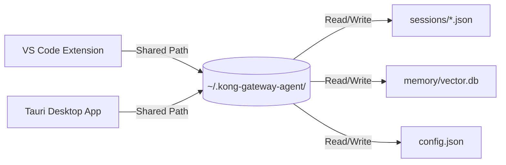

# Standalone Desktop Application: Tauri & React Architecture

This document plans the transition of the Kong Gateway Agent from a VS Code-bound extension to a **Standalone Desktop Application** (built with Tauri and React). 

Because our core architecture is strictly decoupled (`src/core` for business logic, `src/platforms` for shell integrations), porting the agent to a dedicated cross-platform desktop shell is clean and highly efficient.

---

## 1. Architectural Strategy: Tauri vs. Electron

We select **Tauri** (React frontend, Rust system backend) over Electron for the desktop platform wrapper:

| Criterion | Electron | Tauri (Selected) | Why It Matters for Kong Agent |
| :--- | :--- | :--- | :--- |
| **Bundle Size** | ~120 MB | **~8 MB** | Extremely lightweight to download and install. |
| **Memory Footprint** | ~150 MB | **~30 MB** | Stays fast in the background while users compile configs. |
| **System Security** | Large attack surface | **Rust sandboxing** | Running gateway commands require hardened system access. |
| **Startup Time** | Slow | **Instant** | Fast diagnostic checks and CLI triggers. |

---

## 2. Desktop Platform Porting Layer

Our platform-agnostic core operates on the `IAppPlatform` and `IConfig` interfaces. To run standalone, we will implement new concrete classes under a new platform directory: `src/platforms/desktop/`.

```
src/
├── core/                  <-- Shared Business Logic (Agent, Tools, Memory, RAG)
└── platforms/
    ├── vscode/            <-- VS Code Specific Logic
    └── desktop/           <-- [NEW] Tauri Standalone App Logic
        ├── src-tauri/     <-- Rust Core (system commands, native menus)
        └── src/
            ├── DesktopPlatform.ts
            └── DesktopConfig.ts
```

### A. Implementing `DesktopPlatform.ts`
This class implements `IAppPlatform` and maps VS Code actions to native OS calls:
*   **`getStoragePath()`**: Resolves to the native OS User App Data directory:
    *   *macOS*: `~/Library/Application Support/KongGatewayAgent`
    *   *Linux*: `~/.config/konggatewayagent`
    *   *Windows*: `%APPDATA%\KongGatewayAgent`
*   **`openFileInEditor(filePath)`**: Triggers the host operating system's default editor (e.g., launching VS Code or Cursor) or uses a built-in Monaco Editor inside the desktop dashboard.
*   **`openDiffInEditor(original, staged)`**: Renders a rich side-by-side Monaco diff panel natively within the desktop React layout rather than delegating to an external IDE.
*   **`showInformationMessage() / showErrorMessage()`**: Maps to native OS desktop push notifications.

### B. Implementing `DesktopConfig.ts`
Replaces VS Code's `vscode.workspace.getConfiguration` with a lightweight, secure JSON config file (`config.json`) saved in the application storage path, loaded on startup and flushed on modifications.

---

## 3. Standalone Dashboard Interface

The Standalone Desktop App will expand our **Full-Screen Dashboard** into a full terminal-ready control panel:

```
+--------------------------------------------------------------------------+
|  🦍 Kong Gateway Agent Desktop   [Dev Connection]            [ - ] [ x ] |
+--------------------------------------------------------------------------+
|  (S) Sessions     |                                                      |
|  * Staging Sync   |  Active Session: Staging Sync (Remote Gateway)       |
|  - Local Debug    |                                                      |
|  - API Export     |  [Chat Input]                      [decK Diff Panel] |
|                   |  User: Run a lint check.          Running Lint check |
|-------------------|  Agent: 1 issue found...           - no-secrets: ok  |
|  [Diagnostics]    |                                    - format: warning |
|  - Ports: Active  |  +------------------------------+                    |
|  - DB: Synced     |  | Write message...         [>] |  [Apply Corrections] |
|  - CLI: decK 1.39 |  +------------------------------+                    |
+-------------------+------------------------------------------------------+
```

### Key Standalone UX Upgrades:
1.  **System Tray Daemon**: The app can run minimized in the system tray, periodically checking local ports and background git configurations, raising system alerts if live drift is discovered.
2.  **Integrated Monaco Editor**: Complete code editor integration with syntax highlighting for decK YAML states and Docker Compose files.
3.  **Command Execution Bridge**: Uses Tauri's `tauri-plugin-shell` to safely execute local `deck` and `docker` CLI commands after manual user validation.

## 5. Shared State & Concurrent Coexistence Architecture

To support absolute coexistence where the **VS Code Extension** and the **Standalone Desktop App** run concurrently, the architecture must guarantee real-time synchronization, eliminating context drift or write collisions.



### A. Universal Persistent Storage Directory
Instead of isolated app storage spaces, both platforms resolve `getStoragePath()` to a single, unified, platform-standard user directory:
*   **Path**: `~/.kong-gateway-agent/` (e.g., `/Users/username/.kong-gateway-agent/` on macOS).
*   **Shared Assets**:
    *   `/sessions/`: Thread history and active configurations.
    *   `/memory/`: Shared episodic RAG databases and semantic vector index.
    *   `config.json`: The global agent configuration (LLM API keys, mode toggles, skip TLS).
*   **Result**: Starting a chat in VS Code, configuring a gateway, and switching to the Desktop App preserves 100% of the session. The user sees the exact same thread logs and staged files instantly.

### B. Workspace Lockfile Coordination
To prevent file-writing conflicts when both applications edit the same configuration files:
*   **Staged Syncing**: Staged modifications (`.staged_session-<id>_<filename>`) are saved directly inside the target workspace directory. Since both apps read the same directory, staging a change in the Desktop App renders it instantly in VS Code's editor diff view.
*   **Access Mutex**: A simple local lockfile `~/.kong-gateway-agent/sessions/active_session.lock` is updated on state-writing operations to act as a lightweight mutex, preventing concurrent write clashes if the user triggers a sync from both interfaces at the same millisecond.

### C. Live Sync Alerts
When the active session JSON is modified by the Desktop App:
1.  The VS Code Extension's local directory watcher detects the timestamp modification in `~/.kong-gateway-agent/sessions/session-<id>.json`.
2.  VS Code silently updates its memory state and runs a sub-second UI hot-reload.
3.  A subtle toast alert appears: *"🔄 Chat updated from Desktop App."*, maintaining a completely unified developer experience.

---

## 6. Implementation Roadmap

### Phase 1: Tauri Shell Integration [PENDING]
- [ ] Initialize Tauri boilerplate project under `src/platforms/desktop/src-tauri`.
- [ ] Implement `DesktopPlatform.ts` and `DesktopConfig.ts` to bridge core tools to native Rust system APIs.
- [ ] Configure Rust-to-JS command bridging to safely execute native decK and Docker commands.

### Phase 2: Embedded Monaco Layout [PENDING]
- [ ] Integrate `@monaco-editor/react` to render decK YAML files inside the right dashboard panel.
- [ ] Implement embedded side-by-side Monaco diff views to handle staged editing approvals natively.
- [ ] Set up local system tray integrations with native macOS/Windows menu lists.

### Phase 3: Binary Compilation [PENDING]
- [ ] Configure GitHub Actions CI/CD workflows to compile standalone desktop binaries (`.dmg`, `.app`, `.msi`, `.deb`).
- [ ] Set up secure local storage encryption for API keys and Gateway tokens using native Keychain/Credential managers.
