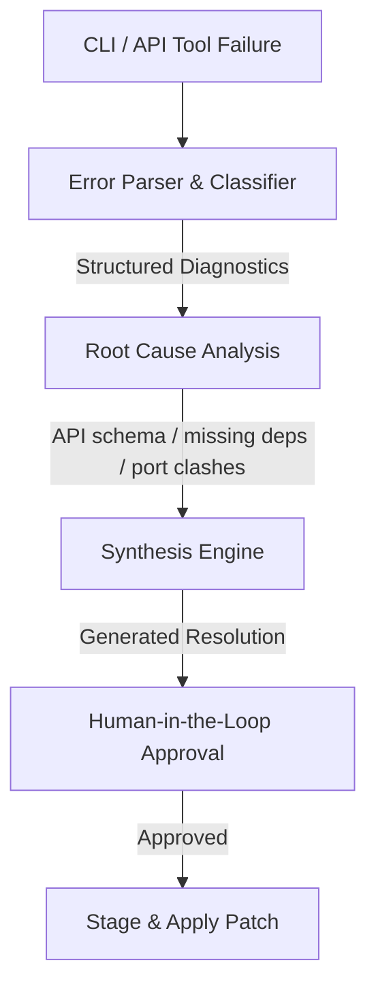

# Diagnostics & Self-Healing Engine: Automated Configuration Repair

The Diagnostics & Self-Healing Engine is an active resilience layer designed to automatically intercept, analyze, and repair failures across Kong Gateway configurations (decK CLI, Admin API, and local Docker containers). 

Instead of dumping raw CLI stack traces or 400 Bad Request errors to the user, the agent actively diagnoses the failure's root cause and synthesizes ready-to-apply corrective patches.

---

## 1. Core Architecture

### A. Error Parser & Classifier
*   **Target**: Stderr, stdout, and network error payloads from tool runs (`deck validate`, `deck sync`, `docker-compose`, `decK lint`, and HTTP Admin API calls).
*   **Goal**: Translate raw text dumps or dense JSON payloads into structured diagnostic exceptions.
*   **Categories**:
    *   `APIOPS_LINT`: Formatting, ruleset violations, or hardcoded value rules.
    *   `GATEWAY_SCHEMA`: Invalid property names, missing mandatory keys, or type mismatches reported by decK or the Kong Admin API.
    *   `DEPENDENCY_MISSING`: Entities (e.g., routes, plugins) referencing parent services or consumer profiles that do not exist.
    *   `ENV_PORT_COLLISION`: Port conflicts (e.g., port 8000/8001 in use) during local gateway startups.
    *   `CONNECTIVITY_FAILURE`: Offline ports, broken auth headers, or DNS failures.

### B. Synthesis Engine (Self-Repair)
When a structured error is caught, the synthesis engine runs task-specific repair handlers to suggest modifications:
1.  **Schema Mismatches**: If Kong rejects a configuration because of a deprecated plugin field or wrong data type, the agent uses the `PromptAnalyser` to locate the exact field in the YAML, match it against correct schemas, and rewrite it.
2.  **Missing Entities**: If a route references a non-existent service `auth-service`, the agent prompts:
    > *"⚠️ **Diagnostic Check**: Your configuration failed validation because route `auth-route` references non-existent service `auth-service`. Would you like me to generate a template service definition for `auth-service`?"*
3.  **Port Conflicts**: If the Docker daemon fails due to port `8001` being allocated, the engine queries the active ports, identifies the conflicting process, and suggests either changing the port configuration in `kong.conf`/`docker-compose` or terminating the process.

### C. Human-in-the-Loop (HITL) Safety Gate
*   **Rule**: The self-healing engine **never** applies changes to files silently.
*   **Flow**: Proposed fixes are generated as **Staged Changes** and rendered in the VS Code diff view. The user must manually inspect and click **"Accept Changes"** before the agent writes them to the main configuration.

---

## 2. Implementation Roadmap

### Phase 1: Structured Error Parsing (Short-Term)
- [ ] Implement `ErrorParser` to extract JSON error payloads from decK validation reports and Kong Admin API HTTP errors.
- [ ] Map raw CLI errors into high-level categorizations (`GATEWAY_SCHEMA`, `PORT_COLLISION`, etc.) to show user-friendly notifications in the Webview.
- [ ] Create diagnostic status alerts in the UI sidebar when a background check fails.

### Phase 2: Synthesis & Auto-Patching (Medium-Term)
- [ ] Create `SelfHealingManager` to generate corrective JSON/YAML patches based on structured errors.
- [ ] Connect the `SelfHealingManager` to the staged-editing workflow, allowing users to apply suggested repairs with a single click.
- [ ] Implement an auto-recovery routine for local Docker start failures (offering automatic port shifting).

### Phase 3: Interactive Diagnostics & Healing Logs (Long-Term)
- [ ] **Interactive Debugger**: Allow users to run an interactive diagnostic session where the agent tests gateway health step-by-step (DNS -> Ports -> Credentials -> DB -> Sync).
- [ ] **Diagnostics Ledger**: Keep a persistent log of past system healing events in `globalStorageUri` to feed successful repair templates into vector memory (Episodic success examples).

---

## 3. Real-World Diagnostic Scenarios

### Scenario A: Missing Target Dependency
*   **Raw Error**: `error: service 'user-service' associated with route 'user-route' does not exist`
*   **Structured Diagnostics**: `DEPENDENCY_MISSING`
*   **Agent Solution**:
    1. Parse the YAML configuration.
    2. Synthesize a stub for `user-service` with default port `80` and host `user-service.internal`.
    3. Present the staged diff adding the service block directly above the route definition.

### Scenario B: Deprecated Schema Property
*   **Raw Error**: `error: plugin 'rate-limiting' invalid: schema check failed: 'config.second' is deprecated or invalid`
*   **Structured Diagnostics**: `GATEWAY_SCHEMA`
*   **Agent Solution**:
    1. Look up `rate-limiting` documentation in semantic memory.
    2. Propose changing `second` to `minute` or adjusting configuration to use contemporary schemas.
    3. Generate the staged fix.
