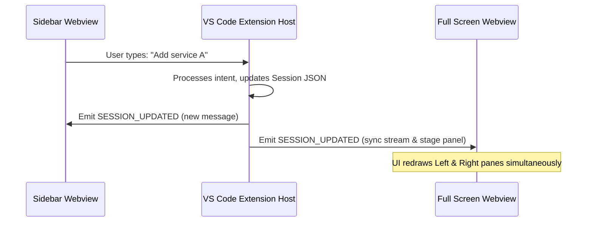

# Full-Screen Dashboard: Workspace Editor Chat Mode

The Full-Screen Dashboard is an advanced layout adaptation that transforms the Kong Gateway Agent from a narrow sidebar chat assistant into a first-class, multi-pane workspace dashboard within a dedicated VS Code Editor Tab.

This mode enables side-by-side chat reasoning, large decK configuration diff rendering, and interactive linter analysis without squeezing UI elements.

---

## 1. User Experience (UX) & Layout Architecture

```
+-----------------------------------------------------------------------+
|  Kong Agent - Full Dashboard                                      [x] |
+------------------------------------+----------------------------------+
|                                    |                                  |
|  LEFT PANEL: Chat Reasoning        |  RIGHT PANEL: Interactive Space  |
|                                    |                                  |
|  [Session: Gateway Migration]      |  [Tabs: decK Diff | Lint | Ports]|
|                                    |                                  |
|  User: Can we add a rate-limit?    |  Showing Diff:                   |
|                                    |  + - - - - - - - - - - - - - - + |
|  Agent: I have staged the change.  |  |  + plugin: rate-limiting    | |
|  Please review the generated diff  |  |    config:                  | |
|  in the right-hand panel before   |  |      second: 10              | |
|  syncing to gateway.               |  + - - - - - - - - - - - - - - + |
|                                    |                                  |
|  +------------------------------+  |  [ Approve & Sync ] [ Discard ]  |
|  | Type message...          [>] |  |                                  |
|  +------------------------------+  |  Linter Audits: 0 warnings       |
|                                    |                                  |
+------------------------------------+----------------------------------+
```

### A. The Sidebar-to-Tab Switcher
*   **Sidebar Trigger**: A distinct icon button (e.g. `[screen-full]` or `[maximize]`) in the header toolbar of the Sidebar Chat Webview.
*   **Action**: Sending an IPC command `OPEN_FULLSCREEN` to the Extension Host.
*   **Host Response**: Launches a tabbed Webview Panel:
    ```typescript
    const panel = vscode.window.createWebviewPanel(
        'kongAgentDashboard',
        `Kong Agent: ${activeSession.title}`,
        vscode.ViewColumn.Active,
        {
            enableScripts: true,
            retainContextWhenHidden: true,
            localResourceRoots: [extensionUri]
        }
    );
    ```

### B. Adaptive Dashboard Grid (Multi-Pane React Layout)
The React application auto-adapts by checking the viewport width or reading an instantiation flag (`layoutType: 'sidebar' | 'dashboard'`):
1.  **Sidebar Mode (< 600px width)**: Standard single-column linear layout containing only the message stream.
2.  **Dashboard Mode (>= 600px width)**: A rich split-panel grid:
    *   **Left Pane (Width: 40%)**: The conversation stream and prompt input container.
    *   **Right Pane (Width: 60%)**: A multi-tab dashboard displaying:
        *   **decK Diff Viewer**: Side-by-side terminal diff of live-vs-local config changes.
        *   **Linter Auditing Panel**: Live rendering of any `deck lint` ruleset violations and hardcoded secret warnings.
        *   **Local Gateway Health**: Port check statuses, active postgres container logs, and connection ping timers.
        *   **Memory fact board**: High-similarity semantic context cards pulled from the memory vector index.

---

## 2. Technical Architecture & State Synchronization

### A. State Coherence & IPC Pipeline
Typing in the sidebar and modifying configurations in the full tab must reflect in real-time across both instances.



*   **Live Synchronization**: The Extension Host manages a single active `AgentState` instance. Whenever the state changes (new message, newly staged changes, or token count updates), the host broadcasts the `SESSION_UPDATED` payload to **both** the sidebar webview and the active editor tab.
*   **Unified Session Manager**: If a user switches threads inside the Full Dashboard drawer, the Sidebar context is automatically kept in lockstep.

---

## 3. Implementation Roadmap

### Phase 1: Webview Panel Infrastructure [PENDING]
- [ ] Implement `vscode.window.createWebviewPanel` registration in the extension host.
- [ ] Establish IPC bridge forwarding between the new panel instance and the existing `ToolManager`/`Agent` instances.
- [ ] Add the maximize switcher icon in the sidebar header view.

### Phase 2: React Dashboard Layout [PENDING]
- [ ] Design the adaptive grid system in the React UI (`App.tsx`) leveraging CSS grid structures.
- [ ] Implement tabbed layout for the Right Pane (`decK Diff`, `Linter Alerts`, `Service Health`).
- [ ] Develop the custom high-performance terminal/diff visualization container within the dashboard.

### Phase 3: Seamless Hydration & Transitions [PENDING]
- [ ] Add smooth window transition animations when spawning the full-screen tab.
- [ ] Persist panel split-widths in VS Code workspace state to recall user sizing preferences on reload.
