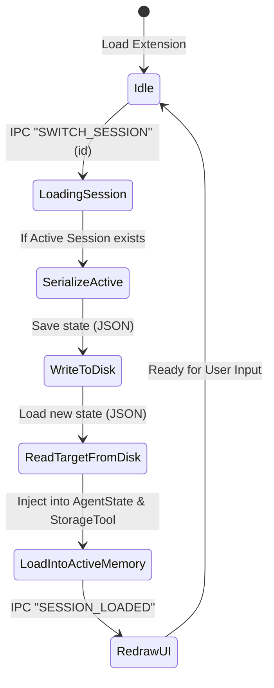

# Multi-Session Chat: Concurrent Task Management

Multi-Session Chat allows users to maintain multiple, independent conversation threads. This is essential for switching between different tasks (e.g., a long-running migration vs. a quick diagnostic check) without losing context or polluting history.

## 1. User Experience (UX)

### A. Session Management UI
*   **Session List**: A vertical list in the VS Code sidebar or a "History" tab in the Chat Webview showing all saved sessions.
*   **New Chat**: A prominent button to start a fresh thread with a clean context.
*   **Session Titles**: The Agent will automatically generate a concise title (e.g., "Auth Service Migration") after the first 2-3 messages using the `PromptAnalyser`.

### B. Switching & State Persistence
*   When a user switches sessions, the current `AgentState` is serialized and archived, and the new session's state is loaded into memory.
*   **Target Isolation**: Each session maintains its own **Configuration Overlay**. This includes:
    *   **Workspace Path**: Pointing to a specific local folder.
    *   **Kong Instance**: Unique URLs, Admin API keys, and port settings.
*   **Staged Changes Isolation**: Each session can have its own set of "Staged Files." This prevents changes from a "Debug" session from accidentally being committed in a "Production Deploy" session.

---

## 2. Technical Architecture

### A. The Multi-Session State Machine



### B. Isolated Configuration & Staged sandbox Overlay
Each session maintains an independent sandbox. When a session is loaded:
1.  **Configuration Overlay**: The active `IConfig` instance intercepts requests for keys like `storagePath`, `adminApiUrl`, and `adminApiPort`. If the active session JSON contains an override, it yields the override; otherwise, it falls back to the default VS Code workspace configuration.
2.  **Staged Changes Isolation**:
    *   The `StorageTool._stagedFiles` memory map is cleared and repopulated strictly with the newly loaded session's `stagedFiles` metadata array.
    *   Hidden files on disk (`.staged_<filename>`) are saved with session-specific suffixes (e.g., `.staged_session-<id>_<filename>`) to prevent file-locking collisions between threads.

### C. Data Schema
Sessions are persisted as structured JSON documents in `globalStorageUri/sessions/`:

```json
{
  "id": "uuid-v4",
  "title": "Migration of Auth Service",
  "createdAt": "2026-05-18T14:49:00Z",
  "updatedAt": "2026-05-18T20:40:00Z",
  "messages": [
    {
      "type": "human",
      "content": "Add consumer named 'test-dev'"
    },
    {
      "type": "ai",
      "content": "I've staged the new consumer...",
      "additional_kwargs": {
        "lastUsage": { "inputTokens": 1400, "outputTokens": 320 }
      }
    }
  ],
  "stagedFiles": [
    {
      "filename": "kong-deck-state.yml",
      "tempPath": "/path/to/globalStorage/sessions/staged_uuid-v4_kong-deck-state.yml",
      "originalContentHash": "d41d8cd98f00b204e9800998ecf8427e"
    }
  ],
  "configOverlay": {
    "storagePath": "/Users/user/projects/service-auth",
    "kongMode": "remote",
    "adminApiUrl": "https://kong-staging.internal"
  },
  "usageStats": {
    "sessionIn": 124000,
    "sessionOut": 12500
  }
}
```

### D. VS Code Webview IPC Communication Schema
The frontend (React Webview) and the host (Extension Host) sync state using specific IPC events:

| Event Type | Direction | Payload | Description |
| :--- | :--- | :--- | :--- |
| `GET_SESSIONS` | UI $\rightarrow$ Host | None | Requests list of available threads on start. |
| `SESSIONS_LIST` | Host $\rightarrow$ UI | `Array<{ id, title, updatedAt }>` | Yields the active session index to populate sidebar drawer. |
| `CREATE_SESSION` | UI $\rightarrow$ Host | `{ title?: string }` | Requests creation of a new thread. |
| `SWITCH_SESSION` | UI $\rightarrow$ Host | `{ id: string }` | Requests context swap to target thread. |
| `SESSION_LOADED` | Host $\rightarrow$ UI | `{ activeSession: SessionObject }` | Delivers the full history, configuration, and stats to redraw chat. |
| `DELETE_SESSION` | UI $\rightarrow$ Host | `{ id: string }` | Removes session JSON file. |

---

## 3. Implementation Roadmap

### Phase 1: Storage Sandboxing & Indexing [PENDING]
- [ ] Refactor `AgentState` to support dynamic instantiation / loading of complete datasets from JSON structures.
- [ ] Create `SessionManager.ts` to manage loading, saving, and deletion of thread files under `globalStorageUri`.
- [ ] Implement isolated staged changes suffix mapping in `StorageTool.ts` to sandbox files by session ID.

### Phase 2: Webview sidebar Drawer [PENDING]
- [ ] Build a sleek React `"SessionsDrawer"` sliding panel in the sidebar UI to display list of threads.
- [ ] Implement sub-second switching with instant loader animations to smooth transition delays.
- [ ] Implement **Auto-Titling Engine**: Analyze the first 2-3 turns using a fast LLM classification call in `PromptAnalyser` to give meaningful titles (e.g. "Docker Port Debugging") instead of generic dates.

### Phase 3: Global Context Synthesis [PENDING]
- [ ] **Cross-Session Recall**: Add a specialized agent tool `recall_session_memory` that allows searching vector embeddings across *other* sessions when requested (e.g. *"What did we do in the staging migration thread?"*).
- [ ] **Shared Workspace Facts**: Allow thread-isolated histories to share a global structural `facts.json` database representing verified environment settings.
